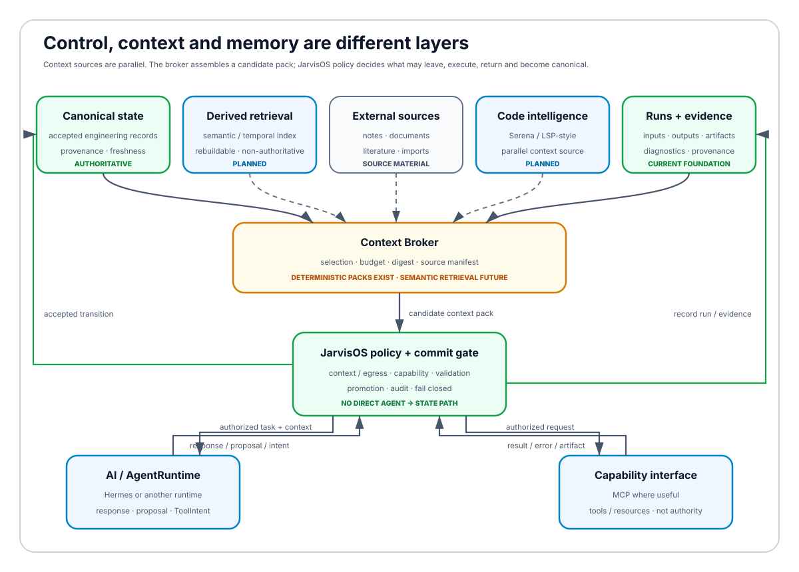
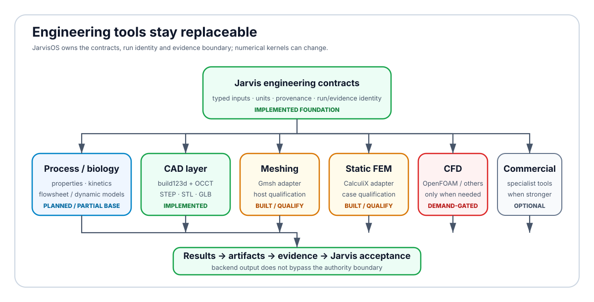
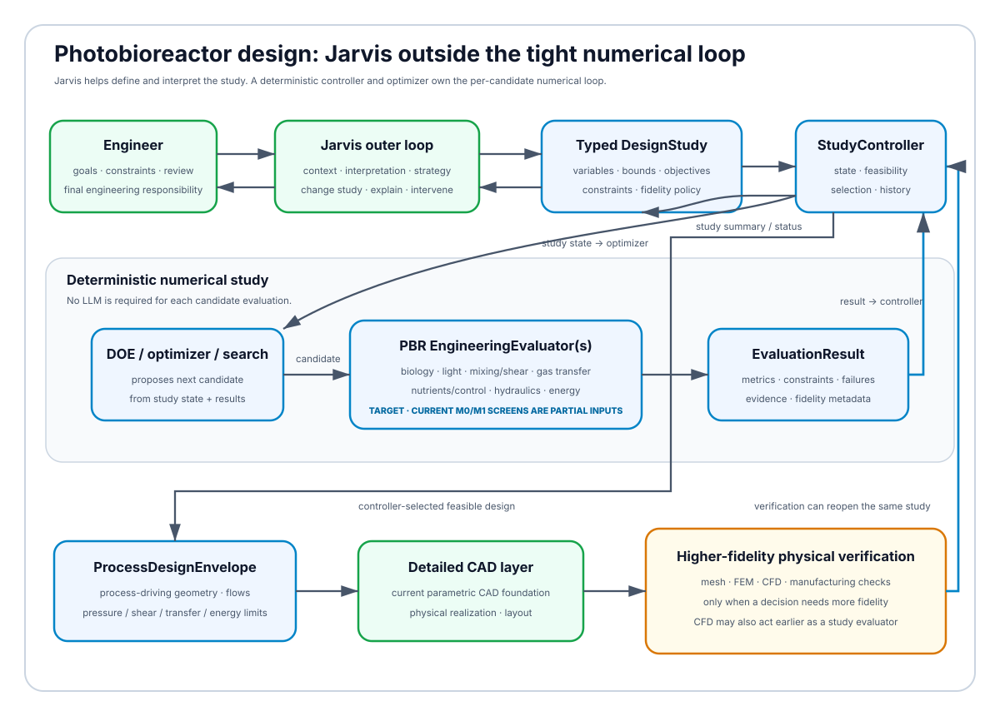

<h1 align="center">JarvisOS</h1>

<h3 align="center">A personal, local-first AI engineering workspace</h3>

<p align="center"><strong>Can an engineering student use AI to assemble a useful engineering environment from strong existing tools without turning the AI into the source of truth?</strong></p>

<p align="center">That is the experiment.</p>

<p align="center"><code>local-first</code> · <code>evidence-first</code> · <code>upstream-first</code> · <code>source-available</code></p>

<p align="center"><a href="#what-is-jarvisos">What it is</a> · <a href="#why-im-building-it">Why</a> · <a href="#how-jarvisos-is-supposed-to-work">How it works</a> · <a href="#what-works-today">What works</a> · <a href="#projects-i-am-evaluating">Upstreams</a> · <a href="#microalgae-photobioreactor-project">Photobioreactor project</a> · <a href="#roadmap">Roadmap</a> · <a href="#technical-details">Technical details</a> · <a href="#licensing-and-collaboration">License & collaboration</a></p>

> **Short version:** JarvisOS is my attempt to connect AI, engineering models, numerical tools, CAD, project memory and evidence in one controlled workspace. I am not trying to rebuild Fusion, Aspen HYSYS, ANSYS or every professional tool from scratch. If an upstream project already solves a problem better than JarvisOS, the default is to integrate or wrap it rather than defend sunk cost.

> **License note:** the repository is publicly source-available for inspection and evaluation, but JarvisOS is **not currently distributed under an open-source software license**. See [Licensing and collaboration](#licensing-and-collaboration).

This README is the public front door to the project. The exact live implementation queue remains [`docs/specs/STATUS.md`](docs/specs/STATUS.md). The canonical architecture is [`docs/ARCHITECTURE.md`](docs/ARCHITECTURE.md).

---

# What is JarvisOS?

JarvisOS is a personal engineering workspace built around one idea: **AI should help me reason, assemble context and use tools, but it should not silently become the owner of engineering truth.**

I want to be able to describe an engineering goal in natural language, let Jarvis assemble bounded context, ask an AI or agent runtime for a proposal when useful, run deterministic calculations or external engineering tools, inspect what happened, and keep a traceable record of the result.

That can mean very different things depending on the problem: calling a process evaluator, generating parametric geometry, running a mesh or FEM solver, searching project knowledge, comparing alternatives, or eventually coordinating a larger design study.

The long-term goal is not one giant model that "does engineering". It is a **controlled workspace that can orchestrate replaceable models and tools while keeping state, provenance and commit authority explicit.**

---

# Why I'm building it

Engineering software is powerful, but it is often expensive, fragmented across many tools and increasingly tied to cloud services. At the same time, AI is becoming good enough to help people cross software boundaries that would previously have required much deeper programming experience.

So I wanted to test a question:

> **What happens if the engineer keeps the domain knowledge and final responsibility, while AI helps connect the software?**

I am a chemical engineering student. I did not start JarvisOS with a traditional software-engineering background, and I do not know in advance how valuable the result will be. That uncertainty is part of the experiment.

If it becomes useful, the useful part should be visible in the code, tests, engineering comparisons and day-to-day workflow. If it does not, those same artifacts should make the limitations visible rather than hiding them behind a polished demo.

### The idea in three lines

| Keep control | Reuse good tools | Verify the result |
| --- | --- | --- |
| Prefer local execution when practical and gate what is allowed to leave the machine. | **Sunk cost is zero:** do not keep an in-house solver or subsystem just because it already exists. Replace it when a stronger upstream is the better boundary. | An AI answer is not engineering evidence. Calculations, runs, artifacts, model limits and acceptance criteria should be inspectable. |

I also do **not** want “local-first” to become an anti-commercial ideology. If a real problem needs HYSYS, ANSYS, Fusion, STAR-CCM+ or another specialist package, JarvisOS should eventually be able to use that package as a backend without making the whole workspace depend on it.

---

# How JarvisOS is supposed to work

The diagrams below distinguish **authority** from **data flow**. A one-way arrow means data or a request moves in that direction; a bidirectional relationship is drawn explicitly. External runtimes and engineering tools are not allowed to bypass the JarvisOS commit boundary.


**Status colors used in the diagrams:** green = implemented foundation · yellow = implemented but partial / qualification still needed · blue = planned target · red = research / demand-gated · gray = optional or replaceable external component.

The governing rule is:

> **The engineer owns final engineering responsibility. JarvisOS owns the software commit boundary. AI and agents propose. Policy authorizes capabilities and egress. Tools execute. Results and evidence return. Canonical state changes only through explicit JarvisOS-controlled transitions.**

Today many final promotion decisions are still explicit user actions. Future automation may handle bounded mechanical cases only after their authority rules are explicit and tested.

### AI, policy and state


An AI response is not a state mutation. A solver result is not automatically an accepted fact. A tool may fail, return partial evidence or produce an output that should be rejected. Those are normal outcomes rather than reasons to blur the authority boundary.

### Control, context and memory

I do not want JarvisOS to have one vague “AI memory”. Different kinds of information have different authority.



The intended split is:

- **canonical project/engineering state** — accepted facts, parameters, decisions and typed engineering records;
- **runs, artifacts and evidence** — exact inputs, outputs, provenance, diagnostics, fidelity and qualification information;
- **derived retrieval memory** — a rebuildable semantic/temporal layer for finding useful context;
- **external notes and documents** — source material, never automatic canonical truth;
- **context broker** — the boundary that assembles bounded context from those sources for an AI or agent runtime.

The repository already has deterministic context-pack assembly and provenance manifests. Semantic/temporal retrieval remains a future derived layer.

Hermes is a candidate AgentRuntime below JarvisOS policy. MCP is a candidate capability/resource interface. Semantic code-intelligence systems such as Serena are parallel context/capability sources, not owners of canonical engineering state.

### Engineering backends

JarvisOS should own the evaluator identity, inputs, units, run/evidence identity and acceptance boundary while numerical kernels remain replaceable.



This is an **adapter/evaluator architecture**, not a claim that every backend implements one universal interface today. Several current paths already have typed contracts; the common evaluator/evidence contract is still being generalized.

The project now follows an explicit upstream-first rule:

> **If JarvisOS has built a generic numerical subsystem that a qualified upstream already solves better, the existing code receives no sunk-cost privilege. Preserve only domain-specific equations, tests or adapters that still add value; replace or delete duplicated solver infrastructure.**

---

# What works today?

The current repository already contains more than a UI mockup, but it is still a beta under construction.

| Capability | Current maturity | What that means |
| --- | --- | --- |
| Backend-owned engineering records, provenance and freshness | **Working, with cleanup queued** | Durable state and lineage exist. A legacy direct-modeling write path still overlaps the newer proposal/promotion boundary and is scheduled for unification. |
| AI routing, budget, egress and policy controls | **Working** | Local-first routes exist; external AI is explicit and gated. |
| Frontend + backend workbench surfaces | **Working / evolving** | The application is connected end to end, but the functional beta is still being completed. |
| Bounded deterministic runner | **Working** | Reviewed deterministic models can execute with persisted runs and artifacts. It is not a hostile-code sandbox. |
| Semantic parametric CAD layer | **Working** | `GeometrySpec` + deterministic build123d/OCP construction and stable geometry artifacts exist for the current bounded vocabulary. |
| STEP / STL / GLB export | **Working** | Current geometry artifacts and manifests are produced. |
| Gmsh meshing adapter | **Implemented; qualification separate** | Integration exists; exact executable/host/scientific qualification is a separate gate. |
| CalculiX static FEM adapter | **Implemented; qualification separate** | Deterministic deck/result handling and verification foundations exist. |
| CAD → mesh → FEM → evidence → UI chain | **Implemented, opt-in** | A real physical-design path exists, including a bounded evidence-guided repair loop. |
| Deterministic photobioreactor screening models | **Working M0/M1 experiments** | Hydraulics, biomass/nutrient bookkeeping, harvesting, buoyancy and optical-transmission proxies exist. They are not an integrated predictive photobioreactor model. |
| Custom process-kernel DAG | **Implemented experiment; no sunk-cost protection** | The current kernel is acyclic/feed-forward and is not the target general PBR solver. It is frozen from expansion pending an upstream bake-off and replacement/retirement decision. |
| Integrated microalgae photobioreactor process evaluator | **Planned** | The real coupled biology/light/mixing/gas-transfer/control problem remains a major engineering gap. |
| Process design / optimization loop | **Planned** | The intended inner loop is deterministic DOE/search/optimization over typed evaluator results; Jarvis stays outside the per-candidate numerical loop. |
| Generic engineering evidence envelope | **Planned / partial foundation** | Current typed evidence is strongest in CAD/mesh/FEM; fidelity, validity-domain and qualification semantics need a common contract. |
| Hermes AgentRuntime / MCP capability layer | **Planned / qualify first** | Candidate runtime/tool layer under JarvisOS authority; currently frozen until the existing queue and revalidation allow it. |
| Engineering Qualification Suite | **Planned** | Starts from real engineering decisions and compares selected evaluators with independent references. |
| Design Explorer / DOE / Pareto studies | **Planned** | Intended to reuse qualified evaluators, not replace them with AI guesses. |
| Generative geometry, surrogates, active learning, specialist training | **Research** | Later work only if deterministic evaluators and real demand justify it. |

The exact implementation state is governed by [`docs/specs/STATUS.md`](docs/specs/STATUS.md), not by this summary.

### A physical-design path that already exists


This is one real path in the repository today. It is **not** the whole architecture, and it is not meant to imply that every future engineering workflow starts from CAD.

---

# Projects I am evaluating

JarvisOS is intentionally not being designed in isolation. A large part of the work is finding strong existing projects, understanding what they already solve, and deciding where JarvisOS should integrate instead of reinventing.

The list below is a shortlist, not a dependency promise. “Reference”, “candidate” and “current dependency” are deliberately different states.

## Orchestration, tools and memory

| Project / ecosystem | Current relationship |
| --- | --- |
| [NousResearch Hermes Agent](https://github.com/NousResearch/hermes-agent) | Leading AgentRuntime candidate for later qualification; not integrated and never canonical authority. |
| [Model Context Protocol](https://github.com/modelcontextprotocol/specification) | Candidate standard capability/resource boundary. |
| [Serena](https://github.com/oraios/serena) | Candidate semantic code-intelligence backend through language servers. |
| [OpenAI Codex](https://github.com/openai/codex) | Architectural/runtime reference and coding-agent tool; not JarvisOS authority. |
| [Claude Agent SDK](https://github.com/anthropics/claude-agent-sdk-python) | Architectural/runtime reference for permissioned tool use. |
| [Graphiti](https://github.com/getzep/graphiti), [Mem0](https://github.com/mem0ai/mem0), [Cognee](https://github.com/topoteretes/cognee) | Candidate ideas/backends for **derived**, rebuildable retrieval memory. |
| [OpenTelemetry](https://github.com/open-telemetry/opentelemetry-specification) | Candidate observability standard; telemetry is not engineering authority. |

## Engineering and scientific tools

| Project / ecosystem | Current relationship |
| --- | --- |
| [build123d](https://github.com/gumyr/build123d) + [Open CASCADE / OCCT](https://github.com/Open-Cascade-SAS/OCCT) | **Current dependency** for the bounded parametric CAD path. |
| [Gmsh](https://gitlab.onelab.info/gmsh/gmsh) | **Current adapter** for meshing; qualification remains use-case-specific. |
| [CalculiX](https://www.calculix.de/) | **Current adapter** for static FEM; qualification remains use-case-specific. |
| [CoolProp](https://github.com/CoolProp/CoolProp) + [thermo](https://github.com/CalebBell/thermo) / [chemicals](https://github.com/CalebBell/chemicals) / [fluids](https://github.com/CalebBell/fluids) | Candidate property, transport, hydraulic and thermodynamic building blocks. |
| [BioSTEAM](https://github.com/BioSTEAMDevelopmentGroup/biosteam) + [QSDsan](https://github.com/QSD-Group/QSDsan) | High-priority candidates/references for bio/process simulation, uncertainty and TEA-style workflows. |
| [IDAES](https://github.com/IDAES/idaes-pse) + [Pyomo](https://github.com/Pyomo/pyomo) + [WaterTAP](https://github.com/watertap-org/watertap) | High-priority candidates for equation-oriented process modeling, optimization and reusable property/unit-model contracts. |
| [DWSIM](https://github.com/DanWBR/dwsim) + [CAPE-OPEN](https://www.cape-open.com/) | Candidate open process-simulation/interoperability backend. |
| [OpenMDAO](https://github.com/OpenMDAO/OpenMDAO) + [CasADi](https://github.com/casadi/casadi) | Candidates for multidisciplinary studies, nonlinear/dynamic optimization and the future Design Explorer. |
| [OpenFOAM](https://github.com/OpenFOAM/OpenFOAM-dev) | Candidate high-fidelity CFD evaluator when lower-cost models cannot resolve a named decision. |
| [LEAP71 ShapeKernel](https://github.com/leap71/LEAP71_ShapeKernel) | Later computational/generative geometry reference if real use justifies it. |

Before the PBR implementation expands, the custom process stack will be compared against these upstreams with **zero sunk-cost preference**. Generic solver infrastructure that is duplicated by a stronger qualified upstream should be retired rather than maintained in parallel.

The fuller audit trail is in [`docs/IDEA_INTAKE_AND_CANDIDATE_INTEGRATIONS.md`](docs/IDEA_INTAKE_AND_CANDIDATE_INTEGRATIONS.md).

---

# Microalgae photobioreactor project

One of the first real engineering problems I want to use JarvisOS on is a personal **microalgae photobioreactor project**.

The important question is not “how do I draw the reactor?”. It is:

> **Given the biology, light, mixing, gas transfer, shear, pressure drop and energy demand, which operating conditions and reactor dimensions actually make sense?**

That makes process evaluation and process design the first major engineering capability needed for this project.



### The target architecture is an iterative study, not a one-way pipeline

The model can progressively bring together the phenomena that actually matter:

- microalgal growth, productivity, limitation and inhibition;
- light availability, attenuation, self-shading, photolimitation and photoinhibition;
- circulation, mixing, recirculation time, dead zones and light/dark exposure;
- shear stress and biological shear limits;
- baffles or static mixers when they matter;
- CO2 delivery, O2 removal, gas-liquid transfer and `kLa`-type behaviour;
- aeration and gas-flow demand;
- nutrient dosing, pH and temperature control when relevant;
- pressure drop, pump/compressor demand and energy consumption;
- the trade-off between productivity, viability, transfer limits, footprint and energy.

The integrated predictive model does **not** exist end to end yet. Current process code is a collection of bounded screening experiments and an acyclic custom kernel, not a general recycle/dynamic PBR simulator.

### Jarvis belongs in the outer loop

A numerical optimizer should not require an LLM decision between every candidate.

The intended separation is:

```text
Engineer ⇄ Jarvis
       goals · constraints · interpretation · intervention
                    ⇅
             typed DesignStudy
                    ⇅
              StudyController
                    ⇅
          DOE / optimizer / search
                    ⇅
       one or more EngineeringEvaluators
                    ⇅
  EvaluationResult + evidence + failure state
```

The optimizer receives every result directly and chooses the next candidate according to a reproducible algorithm. Jarvis sees the study, explains it, can change goals or strategy, and can intervene; it does not need to spend model calls inside the tight numerical loop.

### Process geometry before detailed CAD

Tube diameter, length, number of loops and similar quantities are already geometric variables, but they are initially **process-design geometry**, not a complete CAD model.

The intended handoff is:

```text
process variables + operating variables
        ↓
Abstract ProcessDesignEnvelope
        ↓
selected feasible design
        ↓
DetailedGeometrySpec / CAD realization
        ↓
mesh / FEM / CFD / manufacturability when required
        ↓
feedback to the study if physical verification invalidates an assumption
```

CFD is not forced to the end of the chain. It can act as a selected higher-fidelity evaluator inside the design study when mixing, shear, gas transfer or another field quantity cannot be resolved by a cheaper model.

---

# Roadmap

The public roadmap is intentionally coarse. The live implementation sequence remains in [`docs/specs/STATUS.md`](docs/specs/STATUS.md).

```text
FINISH CURRENT FUNCTIONAL BETA
        ↓
GLOBAL VISUAL IDENTITY
        ↓
ARCHITECTURE / STATE DEBT REPAYMENT
one canonical write path · parameter-state semantics · general evidence contract
remove dead/duplicated generic infrastructure · resolve lineage/flowsheet naming
        ↓
FRESH UPSTREAM / CORE / RUNTIME REVALIDATION
zero sunk-cost bake-off · Hermes/MCP/sandbox/model runtimes only where justified
        ↓
PBR ENGINEERING EVALUATOR
selected upstream process/dynamic stack + domain-specific equations
biology · light · mixing/shear · gas transfer · control · hydraulics · energy
        ↓
PROCESS DESIGN STUDY CONTROLLER
DOE · optimization · feasibility · failure taxonomy · multi-fidelity escalation
        ↓
PROCESS-DESIGN → CAD HANDOFF
abstract design envelope → detailed physical realization
        ↓
MESH / CFD / FEM / MANUFACTURABILITY
when the engineering decision needs them
        ↓
FIRST REAL MICROALGAE PROJECT CASES
        ↓
DOMAIN-SPECIFIC ENGINEERING QUALIFICATION
        ↓
DESIGN EXPLORER
Pareto · uncertainty · evidence-grounded explanation
        ↓
ADVANCED GENERATIVE ENGINEERING
surrogates · active learning · generative geometry · specialist training
```

The principle is:

> **Build something usable → remove architecture that exists only because it was built earlier → use the strongest qualified upstreams → solve a real engineering problem → qualify what the real problem actually depends on.**

---

# Technical details

Everything below this point is intentionally more technical.

## Current application stack

### Backend

- **Python**
- **FastAPI**
- **Pydantic**
- **Pint** for units
- **SQLite**-backed durable application state
- **httpx** and explicit provider/runtime adapters
- **PyYAML** for bounded configuration surfaces

Pinned backend dependencies: [`backend/requirements.txt`](backend/requirements.txt).

### Frontend

- **React 18**
- **TypeScript**
- **Vite**
- **Three.js** for 3D engineering inspection

Pinned frontend dependencies: [`frontend/package.json`](frontend/package.json).

### Current engineering stack

- **build123d / OCP / OpenCascade** for deterministic B-Rep geometry;
- **Gmsh** through a registry-bound external-tool adapter for meshing;
- **CalculiX** through a registry-bound adapter for static FEM;
- bounded photobioreactor M0/M1 screening calculations and runner experiments;
- typed simulation runs, artifacts, manifests, digests and CAD/mesh/FEM evidence.

The current Gmsh and CalculiX integrations are intentionally safe-default disabled until an operator provides an exact executable/version/provenance/hash-qualified registry entry. An adapter being implemented is not the same as a solver being scientifically qualified for every use case.

## Architectural ownership

JarvisOS is intended to own:

- canonical project and engineering state;
- engineering identity, units, provenance and freshness;
- AI route/budget/egress policy;
- capability grants and the software commit/promotion boundary;
- run/artifact/evidence identity;
- evaluator contracts that let numerical backends remain replaceable.

The engineer remains responsible for the engineering decision. External systems may own replaceable mechanics:

- agent loops and session runtimes;
- model inference;
- semantic code intelligence;
- derived retrieval indexes;
- sandbox/isolation mechanisms;
- CAD/mesh/CFD/FEM/property/process numerical kernels;
- optimization algorithms;
- telemetry transport.

> **JarvisOS should own engineering intent, state transitions and evidence identity; numerical kernels receive no sunk-cost privilege.**

## Current authority debt being removed after visual identity

Two current implementation details are intentionally documented rather than hidden:

1. the newer MemoryStore proposal/promotion lifecycle coexists with older modeling CRUD paths that can create records directly; these write semantics will be unified behind one canonical-state boundary;
2. Parameter lifecycle state and value-quality state are distinct concepts but currently use overlapping terminology and context-selection behavior; authoritative context must require an accepted lifecycle state as well as an allowed value-quality state.

These are queued architecture corrections, not properties the README pretends are already solved.

## Memory, context and evidence

| Layer | Authority | Current direction |
| --- | --- | --- |
| Canonical structured state | **Authoritative after commit** | Proposed/accepted/rejected/superseded engineering records, with one canonical write boundary as the target. |
| Runs / artifacts | **Execution record** | Exact run identity, inputs, outputs, manifests, digests and provenance. |
| Typed engineering evidence | **Evidence, scoped by fidelity/qualification** | Strong current CAD/mesh/FEM implementation; common evidence envelope is queued. |
| Derived semantic/temporal retrieval | **Non-authoritative** | Future rebuildable index. |
| External notes / documents | **Source material** | Bounded context sources; explicit promotion required. |

## Agent/runtime model

The future runtime direction is adapter-based:

```text
canonical/context/evidence sources
          ↓
      Context Broker
          ↓ bounded context
Jarvis policy / capability boundary
          ⇅
    AgentRuntime adapter
          ⇅
Hermes / another qualified runtime
          ⇅
MCP / capability gateway
          ⇅
Jarvis services + engineering adapters
```

The return path is explicit: AI/agent outputs return as responses, proposals or tool intents; they do not write canonical state directly.

Hermes is currently a candidate, not an integrated dependency and not canonical authority.

## Current physical-design chain

```text
operator / Jarvis proposal
        ↓
CAD candidate + GeometrySpec
        ↓
build123d / OCP
        ├── STEP / STL / GLB + manifests / digests
        ↓
registry-bound Gmsh
        ├── mesh + physical groups + quality evidence
        ↓
registry-bound CalculiX
        ├── solver outputs + parsed result summary
        ↓
SimulationRun + artifacts + typed evidence + acceptance criteria
        ↓
FastAPI read models → CAD / Runs / Analytics frontend

criteria failure, when the bounded repair mode is enabled:
        └──────── evidence → repair proposal → rebuild → resimulate
```

## Current process-model reality

The repository contains useful deterministic screening models, but their boundaries matter:

- the biomass/nutrient/harvest model uses productivity as an input rather than predicting it from coupled biology/light/transport;
- the optical model is a bounded transmission proxy rather than a full light-field/photosynthesis model;
- the custom `process_kernel` executes acyclic typed block graphs and is therefore not a general recycle, algebraic-loop, ODE or DAE process solver;
- the dependency/provenance module historically named `flowsheet` is not the same thing as a process flowsheet and is queued for naming cleanup.

No new generic process-solver capability should be added to the custom kernel before the upstream bake-off.

## Engineering qualification philosophy

A numerical tool is not accepted because it is open source, popular or produces a plausible plot.

For a real engineering decision, qualification can compare selected evaluators against analytical solutions, trusted correlations, literature or experimental data, independent numerical implementations and commercial engineering software where a meaningful comparison is available.

The useful question is not:

> *Is JarvisOS equivalent to every feature of Fusion, Aspen HYSYS, ANSYS or STAR-CCM+?*

It is:

> **For the engineering decisions I actually need to make, are the selected evaluators accurate, robust, reproducible, appropriately qualified and traceable enough to be useful?**

A result should eventually carry, where relevant, evaluator/version identity, fidelity, validity domain, qualification state, uncertainty and known exclusions. Provenance alone does not make a model scientifically valid.

## Repository map

```text
backend/    FastAPI application, state/policy services, AI/runtime logic, engineering adapters and tests
frontend/   React + Vite + TypeScript operator application
scripts/    Windows startup, local probes, smoke/evaluation helpers
schemas/    design-time schemas
reports/    generated bounded evaluation/smoke reports
docs/       architecture, specs, strategy, audits, evidence and historical design records
```

Important documentation entry points:

- [`docs/specs/STATUS.md`](docs/specs/STATUS.md) — **sole live implementation/queue authority**;
- [`AGENTS.md`](AGENTS.md) — hard repository invariants for coding agents;
- [`docs/AGENT_EXECUTION_AND_AUTOMATION_PROTOCOL.md`](docs/AGENT_EXECUTION_AND_AUTOMATION_PROTOCOL.md) — exact-head delivery and automation rules;
- [`docs/ARCHITECTURE.md`](docs/ARCHITECTURE.md) — canonical current architecture and known debt;
- [`docs/strategy/JARVISOS_ARCHITECTURE_RECONCILIATION_2026-08-21.md`](docs/strategy/JARVISOS_ARCHITECTURE_RECONCILIATION_2026-08-21.md) — the zero-sunk-cost reconciliation and post-visual-identity correction plan;
- [`docs/IDEA_INTAKE_AND_CANDIDATE_INTEGRATIONS.md`](docs/IDEA_INTAKE_AND_CANDIDATE_INTEGRATIONS.md) — audited candidate/upstream register.

## Running the current development build

JarvisOS is currently Windows-first.

One-click local start:

```text
Start-JarvisOS.cmd
```

Separate launchers:

```text
Start-JarvisOS-Backend.cmd
Start-JarvisOS-Frontend.cmd
```

PowerShell launchers:

```powershell
.\scripts\init-database.ps1
.\scripts\start-backend.ps1
.\scripts\start-frontend.ps1
```

Default local development endpoints:

```text
frontend: http://localhost:5173
backend:  http://localhost:8000
```

Representative local checks:

```powershell
cd backend
.\.venv\Scripts\python -m pytest -q
.\.venv\Scripts\python -m ruff check app tests

cd ..\frontend
npm run build
```

---

# Licensing and collaboration

Copyright © 2026 Alberto Racerro. All rights reserved.

This repository is publicly available for inspection and evaluation, but **no software license is currently granted for JarvisOS itself**.

Except for the limited rights provided by GitHub's Terms of Service for use through GitHub's functionality, no permission is granted to use, copy, modify, distribute, sublicense, sell, commercialize or create derivative products from this codebase unless separately agreed in writing.

Public source availability must therefore **not** be interpreted as an open-source license or a waiver of copyright.

Third-party packages, tools, reference projects and external software retain their own licenses and copyright. Their presence in this README does not place them under the JarvisOS copyright posture.

## Collaboration

I am especially interested in criticism or collaboration around:

- photobioreactors, microalgae and biochemical/process systems engineering;
- process modeling, transport phenomena, hydrodynamics and mass transfer;
- scientific Python and numerical methods;
- CAD/CAE, meshing, CFD/FEM and engineering interoperability;
- local AI runtimes, agent infrastructure, sandboxing and tool protocols;
- engineering validation, provenance and reproducible computational workflows.

A useful contribution is often **not more code**. Sometimes the best contribution is simply pointing me to an existing project that already solves a problem better than something I was about to build.

If you want to discuss the project, suggest an upstream, contribute substantially, explore a research collaboration or talk about licensing, **contact me** through GitHub.

The long-term boundary between protected JarvisOS core components and potentially open/reusable interfaces, adapters, schemas or examples is still under evaluation.

---

## A final note

I do not expect this README to prove that JarvisOS is useful. The interesting part starts when I can use it on real engineering problems and compare the selected evaluators with methods, data and software I already trust.