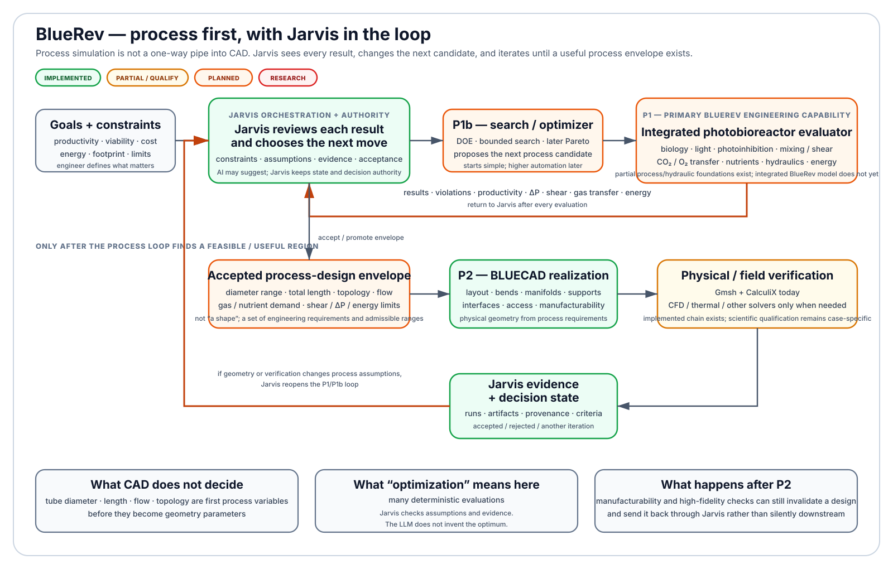
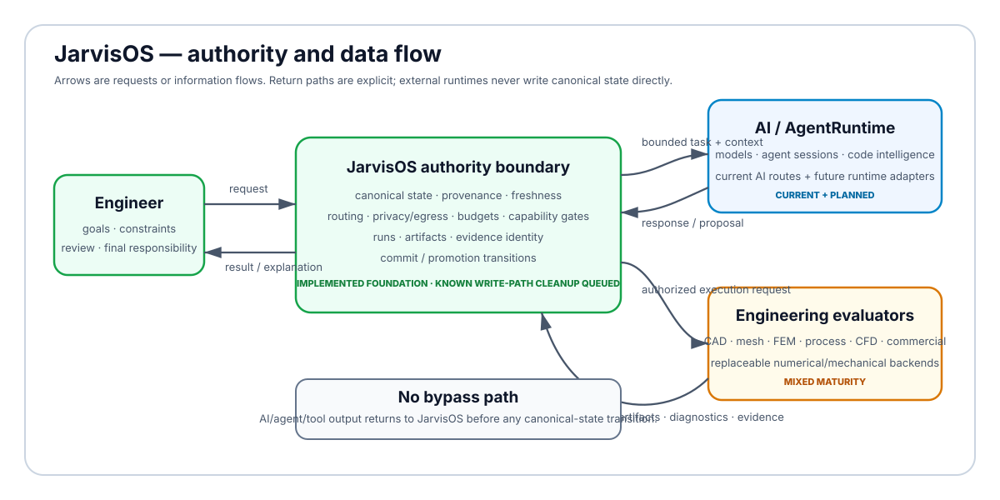
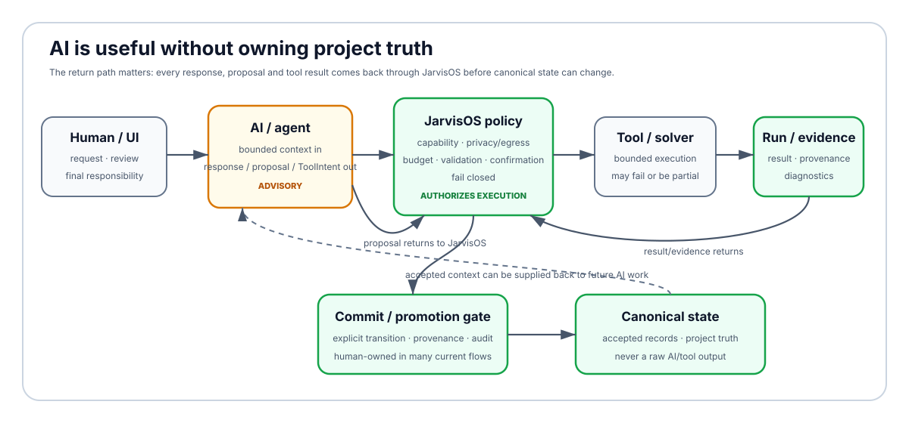
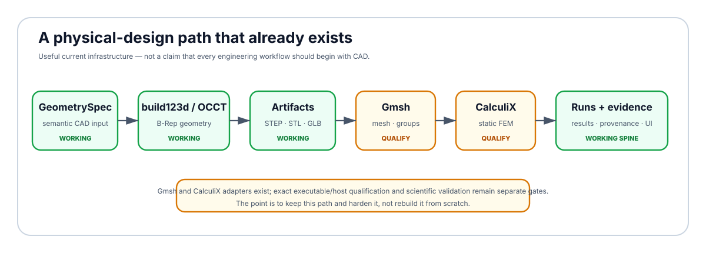

<h1 align="center">JarvisOS</h1>

<h3 align="center">A personal, local-first AI engineering workspace</h3>

<p align="center"><strong>Can a chemical engineering student with almost no traditional software background use AI to build a genuinely useful engineering environment?</strong></p>

<p align="center">That is the experiment.</p>

<p align="center"><code>local-first</code> · <code>process-first</code> · <code>evidence-first</code> · <code>tool-independent</code> · <code>source-available</code></p>

<p align="center"><a href="#why-im-building-it">Why</a> · <a href="#bluerev-the-first-real-engineering-target">BlueRev</a> · <a href="#what-works-today">What works</a> · <a href="#how-jarvisos-is-supposed-to-work">Architecture</a> · <a href="#roadmap">Roadmap</a> · <a href="#for-technical-readers">Technical details</a> · <a href="#source-availability-and-licensing">License</a></p>

> **Short version:** JarvisOS is my attempt to connect AI, engineering models, CAD, numerical solvers, project memory and evidence into one controlled workspace. I am not trying to rebuild Fusion, Aspen HYSYS, ANSYS or every professional tool from scratch. I am trying to make the pieces work together, keep control of the data and workflow, and use the best backend for each problem.

> **License note:** the repository is publicly source-available for inspection and evaluation, but JarvisOS is **not currently distributed under an open-source software license**. See [Source availability and licensing](#source-availability-and-licensing).

This README is the public front door to the project. It explains the idea and the direction. The exact live implementation queue remains [`docs/specs/STATUS.md`](docs/specs/STATUS.md).

---

## Why I'm building it

I started this project from a fairly simple frustration.

Engineering software is powerful, but it is often expensive, fragmented across many tools, and increasingly tied to cloud services. At the same time, AI is getting good enough to help people work across software boundaries that would previously have required much deeper programming experience.

So I wanted to test a question:

> **What happens if the engineer keeps the domain knowledge and final responsibility, while AI helps connect the software?**

I am a chemical engineering student. I did not start JarvisOS with a software-engineering background, and I do not know in advance how valuable the result will be. That uncertainty is part of the experiment.

If the project becomes genuinely useful, that says something interesting about the leverage AI can give to people with domain expertise but limited coding experience. If it does not, the code, tests and engineering comparisons should make that failure visible rather than hiding it behind a polished demo.

### The idea in three lines

| Keep control | Reuse good tools | Verify the result |
| --- | --- | --- |
| Prefer local execution when practical, and gate what is allowed to leave the machine. | Do not rebuild a solver just because it is interesting. Wrap or call the strongest suitable tool instead. | An AI answer is not engineering evidence. Calculations, runs, artifacts and acceptance criteria should be inspectable. |

I also do **not** want “local-first” to become an anti-commercial ideology. If a BlueRev problem genuinely needs HYSYS, ANSYS, Fusion, STAR-CCM+ or another specialist package, JarvisOS should eventually be able to use that package as a backend without making the whole workflow depend on it.

---

# BlueRev: the first real engineering target

The first domain where I want JarvisOS to become genuinely useful is **photobioreactor and process engineering for BlueRev**.

The most important point is easy to miss because the CAD side of the repository is currently more mature:

> **For BlueRev, process simulation is priority #1. CAD is priority #2.**

That means the first real question is not “what shape should the reactor have?”. It is closer to:

> *Given the biology, light, mixing, gas transfer, shear, pressure drop and energy demand, which operating conditions and reactor dimensions actually make sense?*

Only after that process question is sufficiently constrained should CAD turn the answer into a physical object.



### P1 — understand and simulate the process

The target process model can progressively include the phenomena that actually matter for a photobioreactor:

- microalgal growth, productivity, limitation and inhibition;
- light availability, attenuation, self-shading, photolimitation and photoinhibition;
- circulation, mixing, recirculation time, dead zones and light/dark exposure;
- shear stress and biological shear limits;
- baffles or static mixers when they matter;
- CO2 delivery, O2 removal, gas-liquid transfer and `kLa`-type behaviour;
- aeration and gas-flow demand;
- nutrient dosing, pH and temperature control when relevant;
- pressure drop, pump/compressor demand and energy consumption;
- the trade-off between productivity, viability, transfer limits, footprint and energy.

**This integrated BlueRev process model is a target, not a feature claim.** The repository has bounded process/hydraulic foundations today, but the BlueRev-specific end-to-end model is still one of the largest engineering gaps.

### P1b — iterate until the process design makes sense

The process model should not run once and immediately send its output to CAD.

Jarvis should see the result of every evaluation, compare it with constraints and evidence, change the next candidate, and run the process model again. At first that can be a mostly human-guided loop. Later it can use DOE, search and optimization methods.

Typical variables include:

- tube diameter and total length;
- number of loops and reactor topology;
- circulation flow rate and velocity;
- biomass concentration;
- aeration / CO2 flow and injection strategy;
- baffles or static-mixer parameters;
- nutrient and operating conditions.

A central rule is:

> **Tube diameter, length, flow rate and reactor topology are first process-design variables and only secondarily CAD parameters.**

The output of P1/P1b should therefore be a **feasible or optimal process-design envelope**: dimensions, flows, limits, pressure drop, shear, gas-transfer requirements, energy constraints and productivity targets.

### P2 — then make it a real object

BLUECAD receives that process envelope and answers a different question:

> **How do we turn this process design into something that can actually be built, operated, cleaned, supported, inspected and verified?**

That is where geometry, loop arrangement, manifolds, bend radii, supports, interfaces, footprint, accessibility, materials, manufacturability and structural verification become central.

If later geometry or high-fidelity verification invalidates a process assumption, the design goes **back through Jarvis** and re-enters the process loop. It is not a one-way pipeline.

---

# What works today?

The table below is a public orientation snapshot. It deliberately separates **BlueRev priority** from **current implementation maturity**.

| Capability | BlueRev role | Current maturity | What that means |
| --- | --- | --- | --- |
| Jarvis canonical state, provenance and evidence | Foundation | **Working** | Durable backend-owned project/engineering state and evidence relationships exist. |
| AI routing, budget, egress and policy controls | Foundation | **Working** | Local-first routes exist; external AI is explicit and gated. |
| Frontend + backend workbench surfaces | Foundation | **Working / evolving** | The application is connected end to end, but the beta is still being completed. |
| Bounded deterministic runner | Foundation | **Working** | Reviewed deterministic models can execute with persisted runs and evidence. |
| **Integrated BlueRev photobioreactor process model** | **P1 — highest** | **Planned / partial foundations** | The main BlueRev engineering gap after a usable beta. |
| **BlueRev process design / optimization** | **P1b** | **Planned** | Iterative search/DOE/optimization over deterministic process evaluations. |
| BLUECAD semantic parametric geometry | **P2** | **Working** | `GeometrySpec` + deterministic build123d/OCP construction and stable artifacts. |
| STEP / STL / GLB export | P2 support | **Working** | Current geometry artifacts and manifests are already produced. |
| Gmsh meshing adapter | P2 support | **Implemented; qualification separate** | Integration exists, but exact target-host/tool qualification is still a separate gate. |
| CalculiX static FEM adapter | P2 support | **Implemented; qualification separate** | Deterministic deck/result handling and verification foundations exist. |
| CAD → mesh → FEM → evidence → UI | P2 support | **Implemented, opt-in** | Existing chain should be kept, qualified and extended rather than rebuilt. |
| Engineering Qualification Suite | Validation | **Planned** | Begins after a usable beta and first real BlueRev cases. |
| Hermes AgentRuntime / MCP capability layer | Platform | **Planned / qualify first** | Candidate runtime/tool layer under Jarvis authority. |
| Design Explorer / DOE / Pareto studies | Later engineering | **Planned** | Reuses qualified process/physical evaluators; does not replace them with AI guesses. |
| Generative geometry, surrogates, active learning, specialist training | Research | **Requires further research** | Only after deterministic evaluators and real demand justify them. |

### Status vocabulary

- **Working** — a production-reachable path exists and is exercised by the current application/test system.
- **Working / evolving** — the path exists but is still being completed or broadened.
- **Implemented; qualification separate** — the software integration exists, but scientific/host qualification is a separate question.
- **Planned** — there is a concrete architectural target, not an implemented feature.
- **Requires further research** — value, fidelity or integration economics are not yet proven.

---

# How JarvisOS is supposed to work

The diagram below is intentionally **not limited to what is already implemented**. It shows the architecture I currently think is the most promising, while the colors show how much of it exists today.



**Color key:** green = implemented · yellow = implemented but partial / needs qualification · orange = planned target · red = research / demand-gated · gray = optional or replaceable external component.

A useful warning when reading the diagram:

> **Green does not mean “more important”. It only means “more implemented”.**

That distinction matters because BLUECAD is greener than the BlueRev process model today, while the process model is still the higher product priority.

### The central rule

JarvisOS keeps a small **authority core** that owns:

- deterministic policy and approval gates;
- canonical project and engineering state;
- route, budget, privacy and egress decisions;
- run/artifact/evidence identity;
- engineering acceptance and promotion rules.

AI runtimes, model engines, memory indexes and numerical solvers are meant to be **replaceable around that core**.

### Memory is deliberately split into layers

JarvisOS should not have one giant “AI memory”. Different things have different authority:

1. **Canonical structured memory — implemented.** Accepted facts, parameters, decisions and engineering state. Jarvis owns it.
2. **Run / artifact / evidence store — implemented.** Exact inputs, outputs, provenance, diagnostics and artifacts. Jarvis owns it.
3. **Derived retrieval memory — planned.** A semantic/temporal index that helps retrieval but can be rebuilt, invalidated or deleted without losing truth.
4. **External notes / knowledge sources — optional.** Documents, Obsidian-style notes or other sources can feed context, but they do not silently become canonical state.

### Where Hermes fits

Hermes is **not intended to become “the Jarvis backend”**.

The current direction is to treat Hermes as a replaceable **AgentRuntime / tool-orchestration candidate** below Jarvis authority. It can help run sessions, expose large tool catalogs progressively and coordinate tool use, but it should not own:

- canonical engineering state;
- budget or privacy policy;
- unrestricted credentials;
- final permission to mutate state;
- engineering acceptance.

A future MCP/capability gateway would sit between agent runtimes and actual tools so that “the model knows a tool exists” remains different from “the model is allowed to execute it”.

---

# Roadmap

The public roadmap is intentionally coarse. The live implementation sequence remains in [`docs/specs/STATUS.md`](docs/specs/STATUS.md).

```text
FINISH CURRENT FUNCTIONAL BETA
        ↓
GLOBAL VISUAL IDENTITY
        ↓
USABLE END-TO-END JARVISOS BETA
        ↓
FRESH CORE / RUNTIME REVALIDATION
Hermes · MCP · sandbox · model runtimes only where justified
        ↓
P1 — INTEGRATED PHOTOBIOREACTOR PROCESS MODEL
biology · light · mixing/shear · gas transfer · control · hydraulics · energy
        ↓
P1b — PROCESS DESIGN / OPTIMIZATION LOOP
D · L · topology · flow · aeration · operating constraints
        ↓
P2 — BLUECAD PHYSICAL REALIZATION
reuse and extend the existing CAD path
        ↓
MESH / CFD / FEM / MANUFACTURABILITY
only when the engineering decision needs them
        ↓
FIRST REAL BLUEREV ENGINEERING CASES
        ↓
DOMAIN-SPECIFIC ENGINEERING QUALIFICATION
        ↓
DESIGN EXPLORER
DOE · optimization · feasibility · Pareto · evidence-grounded explanation
        ↓
ADVANCED GENERATIVE ENGINEERING
surrogates · active learning · generative geometry · specialist training
```

The important sequence is simpler than the diagram:

> **Build something usable → use it on a real BlueRev problem → discover what has to be trusted → qualify those models → automate broader design exploration.**

The Engineering Qualification Suite is deliberately **not** a prerequisite for ever reaching beta. It starts once there is something real to use and real BlueRev decisions to compare.

JarvisOS also does not need to become a complete replacement for every refinery, combustion, distillation or petrochemical feature in a general industrial simulator. If BlueRev does not need it, it is not automatically a priority.

---

# How AI is allowed to participate



The basic distinction is:

**AI proposes → deterministic policy authorizes → tools execute → evidence returns → Jarvis accepts or rejects.**

An AI can help formulate a model, explain a result, propose geometry, choose a tool, draft code, search the repository or suggest the next experiment. It does **not** become engineering truth because the answer sounds convincing.

This also means:

- tool visibility is not the same as permission;
- permission is not the same as execution;
- execution is not the same as acceptance;
- a result can be valid evidence without automatically mutating canonical state.

---

# For technical readers

Everything below this point is intentionally more technical.

## Current application stack

### Backend

- **Python**
- **FastAPI**
- **Pydantic**
- **Pint** for units
- **SQLite**-backed durable application state
- **httpx** and explicit provider/runtime adapters
- **PyYAML** for bounded configuration surfaces

Pinned backend dependencies: [`backend/requirements.txt`](backend/requirements.txt).

### Frontend

- **React 18**
- **TypeScript**
- **Vite**
- **Three.js** for 3D engineering inspection

Pinned frontend dependencies: [`frontend/package.json`](frontend/package.json).

### Current engineering stack

- **build123d / OCP / OpenCascade** for deterministic B-Rep geometry;
- **Gmsh** through a registry-bound external-tool adapter for meshing;
- **CalculiX** through a registry-bound adapter for static FEM;
- bounded process/hydraulic calculation and runner foundations;
- typed simulation runs, artifacts, manifests, digests, evidence and acceptance criteria.



The current Gmsh and CalculiX integrations are intentionally safe-default disabled until an operator provides an exact executable/version/provenance/hash-qualified registry entry. **An adapter being implemented is not the same as a solver being qualified for every engineering use case.**

## Architectural ownership

JarvisOS is intended to own:

- canonical project and engineering state;
- engineering identity, units, provenance, freshness and acceptance;
- AI route/budget/egress policy;
- capability grants and commit/promotion authority;
- run/artifact/evidence identity;
- semantic engineering contracts that connect replaceable tools.

External systems may own replaceable mechanics:

- agent loops and session runtimes;
- model inference;
- semantic code intelligence;
- derived retrieval indexes;
- sandbox/isolation mechanisms;
- CAD/mesh/CFD/FEM/property/process numerical kernels;
- telemetry transport.

A repeated design principle is:

> **JarvisOS owns semantic engineering intent and evidence; numerical kernels remain replaceable.**

## Memory and evidence model

The intended separation is:

| Layer | Authority | Current direction |
| --- | --- | --- |
| Canonical structured state | **Authoritative** | Jarvis-owned durable accepted/proposed/rejected/superseded records and engineering state. |
| Runs / artifacts / evidence | **Authoritative evidence** | Exact run identity, inputs, outputs, manifests, digests, provenance and criteria. |
| Derived semantic/temporal retrieval | **Non-authoritative** | Future rebuildable index; candidates include Graphiti/Mem0/Cognee-style approaches after qualification. |
| External notes / documents | **Source material** | Optional bounded context sources; promotion to canonical state must be explicit. |

The point is to avoid a vector database or agent memory silently becoming the source of truth.

## Agent/runtime model

The current generic `modules/agents` / `modules/tools` skeletons are not considered a valuable final architecture simply because they already exist.

The future runtime direction is a bake-off / adapter model:

```text
Jarvis authority
      ↓ bounded task + context + capability grant
AgentRuntime adapter
      ↓
Hermes / another qualified runtime
      ↓
MCP / capability gateway
      ↓
existing Jarvis services + numerical-tool adapters
      ↓
evidence returned to Jarvis authority
```

Hermes is currently a **candidate**, not an integrated dependency and not canonical authority.

## Current repository engineering chain

One production-shaped path already present is:

```text
operator / Jarvis proposal
        ↓
BLUECAD candidate + GeometrySpec
        ↓
build123d / OCP
        ├── STEP / STL / GLB + manifests / digests
        ↓
registry-bound Gmsh
        ├── mesh + physical groups + quality evidence
        ↓
registry-bound CalculiX
        ├── solver outputs + parsed result summary
        ↓
SimulationRun + artifacts + typed evidence + acceptance criteria
        ↓
FastAPI read models → BLUECAD / Runs / Analytics frontend
```

For BlueRev, this physical-design chain is intended to sit **after** the process-design loop, except where geometry or verification explicitly feeds back through Jarvis and reopens the process decision.

---

# Selected upstreams and reference projects

JarvisOS is intentionally not designed in isolation. I have been auditing upstream projects to decide whether JarvisOS should **keep**, **wrap**, **replace**, **extend** or simply **learn from** existing software.

The fuller register is [`docs/IDEA_INTAKE_AND_CANDIDATE_INTEGRATIONS.md`](docs/IDEA_INTAKE_AND_CANDIDATE_INTEGRATIONS.md). A project appearing below does **not** mean it is bundled, integrated, endorsed or part of the JarvisOS license.

| Project | Why it matters here | Relationship |
| --- | --- | --- |
| [build123d](https://github.com/gumyr/build123d) | Pythonic parametric B-Rep CAD | Current dependency / BLUECAD geometry foundation |
| [Open CASCADE / OCCT](https://github.com/Open-Cascade-SAS/OCCT) | Mature geometric modeling kernel | Underlying geometry technology / reference |
| [Gmsh](https://gitlab.onelab.info/gmsh/gmsh) | Mesh generation and physical groups | Current external mesher adapter |
| [CalculiX](https://www.calculix.de/) | Open finite-element solver | Current external static-FEM adapter |
| [NousResearch Hermes Agent](https://github.com/NousResearch/hermes-agent) | Agent runtime, progressive tool disclosure, MCP/tool patterns | Future runtime candidate; not canonical authority |
| [Serena](https://github.com/oraios/serena) | Semantic code intelligence through language servers | Future code-intelligence candidate |
| [OpenAI Codex](https://github.com/openai/codex) | Runtime/state/process architecture patterns | Architectural reference / runtime bake-off candidate |
| [Model Context Protocol](https://github.com/modelcontextprotocol/specification) | Tool/context interoperability | Future capability/tool boundary candidate |
| [CoolProp](https://github.com/CoolProp/CoolProp) | Thermophysical properties | Future property/process backend candidate |
| [IDAES](https://github.com/IDAES/idaes-pse) | Equation-oriented process modeling and optimization | High-value process-engineering candidate |
| [BioSTEAM](https://github.com/BioSTEAMDevelopmentGroup/biosteam) | Bioprocess simulation / TEA ecosystem | Future bio/process candidate |
| [DWSIM](https://github.com/DanWBR/dwsim) | Open process simulator and interoperability reference | Possible external process backend |
| [OpenFOAM](https://github.com/OpenFOAM/OpenFOAM-dev) | High-fidelity CFD | Demand-gated backend when cheaper models cannot answer a named decision |
| [LEAP71 ShapeKernel](https://github.com/leap71/LEAP71_ShapeKernel) | Computational/generative engineering geometry | Research candidate after deterministic design infrastructure |

Before substantial reuse, vendoring or dependency adoption, exact upstream version, license, transitive boundary, maintenance cost and measurable benefit should be re-checked. JarvisOS does not need to adopt every interesting repository it studies.

---

# Engineering qualification philosophy

A numerical tool is not accepted because it is open source, popular or produces a plausible plot.

For a real BlueRev decision, qualification can compare JarvisOS-selected evaluators against:

- analytical solutions;
- trusted engineering correlations;
- literature data;
- experimental data when available;
- independent numerical implementations;
- commercial engineering software when a meaningful comparison is available.

The useful question is not:

> *Is JarvisOS equivalent to every feature of Fusion, Aspen HYSYS, ANSYS or STAR-CCM+?*

It is:

> **For the engineering decisions BlueRev actually needs to make, are JarvisOS and its selected backends accurate, robust, reproducible and traceable enough to be useful?**

If the answer for a subsystem is no, the architecture should make it possible to replace that evaluator or call a stronger specialist tool instead of hiding the limitation.

---

# Repository map

```text
backend/    FastAPI application, domain services, AI/runtime logic, engineering adapters and tests
frontend/   React + Vite + TypeScript operator application
scripts/    Windows startup, local probes, smoke/evaluation helpers
schemas/    design-time schemas
reports/    generated bounded evaluation/smoke reports
docs/       architecture, specs, strategy, audits, evidence and historical design records
```

Important documentation entry points:

- [`docs/specs/STATUS.md`](docs/specs/STATUS.md) — **sole live implementation/queue authority**;
- [`AGENTS.md`](AGENTS.md) — hard repository invariants for coding agents;
- [`docs/AGENT_EXECUTION_AND_AUTOMATION_PROTOCOL.md`](docs/AGENT_EXECUTION_AND_AUTOMATION_PROTOCOL.md) — exact-head delivery and automation rules;
- [`docs/ARCHITECTURE.md`](docs/ARCHITECTURE.md) — architecture;
- [`docs/README.md`](docs/README.md) — documentation authority map;
- [`docs/IDEA_INTAKE_AND_CANDIDATE_INTEGRATIONS.md`](docs/IDEA_INTAKE_AND_CANDIDATE_INTEGRATIONS.md) — audited candidate/upstream register;
- [`docs/strategy/JARVISOS_BACKEND_PUZZLE_STRATEGY_2026-08-21.md`](docs/strategy/JARVISOS_BACKEND_PUZZLE_STRATEGY_2026-08-21.md) — future backend strategy;
- [`docs/strategy/JARVISOS_BACKEND_PUZZLE_QUEUE_BLUEPRINT_2026-08-21.md`](docs/strategy/JARVISOS_BACKEND_PUZZLE_QUEUE_BLUEPRINT_2026-08-21.md) — non-authoritative future queue blueprint;
- [`docs/strategy/BLUEREV_ENGINEERING_PRIORITY_AMENDMENT_2026-08-21.md`](docs/strategy/BLUEREV_ENGINEERING_PRIORITY_AMENDMENT_2026-08-21.md) — process-first BlueRev correction.

Older planning documents can remain useful historical evidence without being current implementation authority.

---

# Running the current development build

JarvisOS is currently Windows-first.

One-click local start:

```text
Start-JarvisOS.cmd
```

Separate launchers:

```text
Start-JarvisOS-Backend.cmd
Start-JarvisOS-Frontend.cmd
```

PowerShell launchers:

```powershell
.\scripts\init-database.ps1
.\scripts\start-backend.ps1
.\scripts\start-frontend.ps1
```

Default local development endpoints:

```text
frontend: http://localhost:5173
backend:  http://localhost:8000
```

Recreate backend dependencies:

```powershell
cd backend
python -m venv .venv
.\.venv\Scripts\python -m pip install --upgrade pip
.\.venv\Scripts\pip install -r requirements.txt -r requirements-dev.txt
```

Frontend dependencies:

```powershell
cd frontend
npm install
```

Representative local checks:

```powershell
cd backend
.\.venv\Scripts\python -m pytest -q
.\.venv\Scripts\python -m ruff check app tests

cd ..\frontend
npm run build
```

The repository also uses CI and exact-head gates; internal execution documentation remains authoritative for the development workflow.

---

# Collaboration

I am especially interested in criticism and collaboration around:

- photobioreactors, microalgae and biochemical/process systems engineering;
- process modeling, transport phenomena, hydrodynamics and mass transfer;
- scientific Python and numerical methods;
- CAD/CAE, meshing, CFD/FEM and engineering interoperability;
- local AI runtimes, agent infrastructure, sandboxing and tool protocols;
- engineering validation, provenance and reproducible computational workflows.

A useful contribution is often **not more code**. Sometimes the best contribution is evidence that an existing project already solves a problem better than something JarvisOS was about to build.

Please use GitHub discussions/issues where appropriate or contact the repository owner before proposing substantial code, research, integration or commercial collaboration.

---

# Source availability and licensing

Copyright © 2026 Alberto Racerro. All rights reserved.

This repository is publicly available for inspection and evaluation, but **no software license is currently granted for JarvisOS itself**.

Except for the limited rights provided by GitHub's Terms of Service for use through GitHub's functionality, no permission is granted to use, copy, modify, distribute, sublicense, sell, commercialize or create derivative products from this codebase unless separately agreed in writing.

Public source availability must therefore **not** be interpreted as an open-source license or a waiver of copyright.

Third-party packages, tools, reference projects and external software retain their own licenses and copyright. Their presence in documentation does not place them under the JarvisOS copyright posture.

If you are interested in using JarvisOS, building on it, integrating a component, contributing substantially, conducting research together or discussing commercial licensing, contact the repository owner first. Terms can be considered case by case.

The long-term boundary between protected JarvisOS core components and potentially open/reusable interfaces, adapters, schemas or examples is still under evaluation.

---

## A final note on expectations

This repository is public enough to be inspected, so the useful standard is not whether the project sounds ambitious. It is whether individual claims survive inspection by people who know more than I do.

Where the code works, the README should say that it works. Where an integration exists but is not scientifically qualified, it should say so. Where something is planned, it should not be presented as a feature. Where an existing project is better than a custom implementation, JarvisOS should prefer reuse or integration.

That distinction is part of the project.
